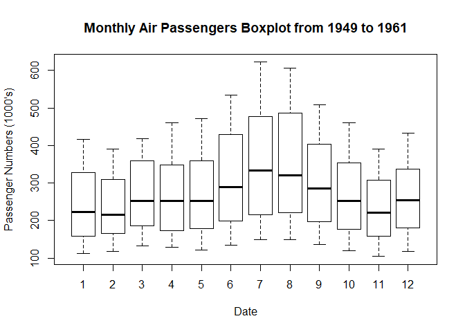

AirPassengers
================
Sujit
April 13, 2018

### Exploratory Data Analytics on AirPassengers

-   Load and View data

``` r
data("AirPassengers") # load the dataset
ap<-AirPassengers
```

-   Exploratory Analysis

``` r
sum(is.na(ap)) # Number of NAs present in the dataset
```

    ## [1] 0

``` r
start(ap) # start of time series
```

    ## [1] 1949    1

``` r
end(ap)  # end of time series
```

    ## [1] 1960   12

``` r
frequency(ap) # Number of cycles per year
```

    ## [1] 12

``` r
cycle(ap)    # Year wise cycles
```

    ##      Jan Feb Mar Apr May Jun Jul Aug Sep Oct Nov Dec
    ## 1949   1   2   3   4   5   6   7   8   9  10  11  12
    ## 1950   1   2   3   4   5   6   7   8   9  10  11  12
    ## 1951   1   2   3   4   5   6   7   8   9  10  11  12
    ## 1952   1   2   3   4   5   6   7   8   9  10  11  12
    ## 1953   1   2   3   4   5   6   7   8   9  10  11  12
    ## 1954   1   2   3   4   5   6   7   8   9  10  11  12
    ## 1955   1   2   3   4   5   6   7   8   9  10  11  12
    ## 1956   1   2   3   4   5   6   7   8   9  10  11  12
    ## 1957   1   2   3   4   5   6   7   8   9  10  11  12
    ## 1958   1   2   3   4   5   6   7   8   9  10  11  12
    ## 1959   1   2   3   4   5   6   7   8   9  10  11  12
    ## 1960   1   2   3   4   5   6   7   8   9  10  11  12

``` r
summary(ap)  # Table Summary
```

    ##    Min. 1st Qu.  Median    Mean 3rd Qu.    Max. 
    ##   104.0   180.0   265.5   280.3   360.5   622.0

``` r
# Add a regression line to the time series plot
plot(ap)+
abline(reg = lm(AirPassengers~time(ap)))
```


    ## integer(0)

``` r
# Plot the raw data
# Using ggfortify package extension of ggplot2

autoplot(ap) + labs(x ="Date", y = "Passenger numbers (1000's)",
                    title="Air Passengers from 1949 to 1961") 
```


``` r
# Use of boxplot to see seasonal changes

boxplot(ap~cycle(ap),xlab="Date", ylab = "Passenger Numbers (1000's)" ,main ="Monthly Air Passengers Boxplot from 1949 to 1961")
```



``` r
# Check for stationary

temp<-log(AirPassengers)  # makes the variances equal

plot(temp)
```


``` r
stationaryAp<-diff(temp) # makes the mean equal

plot(stationaryAp)
```


``` r
# Hypothesis testing for stationary time series using Dickey fuller test

adf.test(stationaryAp)
```

    ## 
    ##  Augmented Dickey-Fuller Test
    ## 
    ## data:  stationaryAp
    ## Dickey-Fuller = -6.4313, Lag order = 5, p-value = 0.01
    ## alternative hypothesis: stationary

-   From these exploratory plots, we can make some initial inferences:

-   The passenger numbers increase over time with each year which may be indicative of an increasing linear trend, perhaps due to increasing demand for flight travel and commercialisation of airlines in that time period.
-   In the boxplot there are more passengers travelling in months 6 to 9 with higher means and higher variances than the other months, indicating seasonality with a apparent cycle of 12 months. The rationale for this could be more people taking holidays and fly over the summer months in the US.
-   AirPassengers appears to be multiplicative time series as the passenger numbers increases, it appears so does the pattern of seasonality.
-   There do not appear to be any outliers and there are no missing values. Therefore no data cleaning is required.

``` r
# Decompose of time series can be of two types
#  Additive- x(t)=trend+seasonal+error
#  Multiplicative- x(t)=trend*seasonal+error

decomposeAp<-decompose(ap,"additive")

plot(decomposeAp)
```


``` r
# Number of differentiations required to make the series stationary and find 'd'
ndiffs(AirPassengers)  
```

    ## [1] 1

``` r
acf(diff(AirPassengers))  # Auto correlation to find the 'p' value
```


``` r
pacf(diff(AirPassengers)) # partial auto correlation to find 'q' value
```


``` r
# From ndiffs,acf,pacf we get the values of of p,d,q as 0,1,1 respectively
# Model is created and trained using arima()
fit<-arima(x = AirPassengers,order = c(0,1,1),seasonal = list(order = c(0, 1, 1),period = 12))
plot(forecast(fit,12)) # Data is forecasted for a year
```


